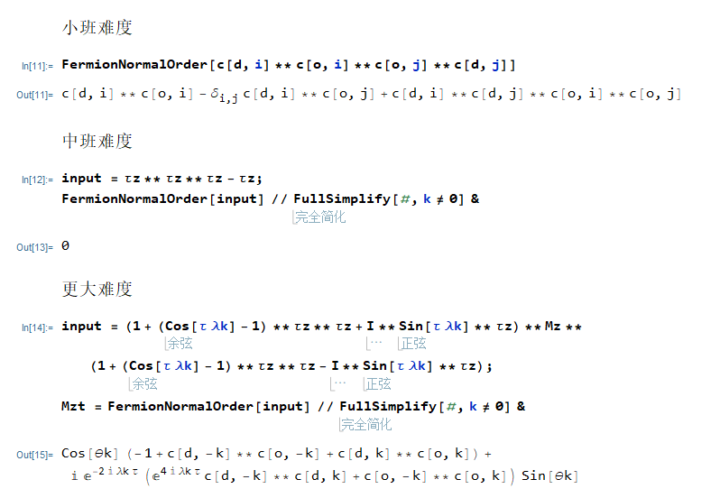

# NormalOrder
 Mathemetica package: calculate normal order for fermionic operator.

可以看到程序包提供了2个函数两个变量。其中FermionNormalOrder用来计算费米子正常序。c[d,i]代表$c^\dagger_i$,c[o,j]代表$c_j$。需要注意费米子算符之间必须使用**即NonCommutativeMultiply。

